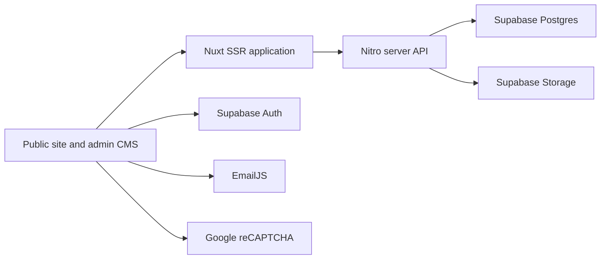

# RV Rioflorido Construction

Production website and project-management portal for RV Rioflorido Construction. The application presents the company portfolio and services publicly, while authenticated administrators manage projects and their images through a protected CMS.

The app is server-rendered with Nuxt 3. Nuxt/Nitro server routes provide the application API, and Supabase supplies Postgres, authentication, and object storage.

## Features

- Responsive public website for projects, services, aluminum products, company information, and contact details
- GSAP-powered mobile navigation with animated panel expansion and staggered link transitions
- Supabase-backed project cards, project detail pages, and image galleries
- Protected project CMS at `/admin/projects`
- Google OAuth and email/password login through Supabase Auth
- UUID-based admin authorization through `public.admin_users`
- Drag-and-drop thumbnail, cover, and gallery uploads with local previews
- Server-side image validation and WebP conversion before Supabase Storage upload
- Project deletion that also removes associated storage objects
- EmailJS contact form with Google reCAPTCHA v2
- Sitemap, robots configuration, social metadata, structured data, and security headers

## Technology stack

| Area | Technology |
| --- | --- |
| Application | Nuxt 3, Vue 3, TypeScript/JavaScript |
| Server | Nitro and H3 server routes |
| Styling and motion | Tailwind CSS, Flowbite Tailwind plugin, GSAP, custom PP Neue Montreal fonts |
| Database | Supabase Postgres |
| Authentication | Supabase Auth: Google OAuth and email/password |
| Image storage | Supabase Storage |
| Image processing | Sharp, converted to WebP on upload |
| UI media | Swiper and baguetteBox.js |
| Contact form | EmailJS and Google reCAPTCHA v2 |
| SEO | Nuxt Sitemap and Nuxt Robots |
| Deployment | Vercel-compatible Node SSR output |

## Architecture



Public pages read project data through the local `/api/projects` routes. Admin writes also use these server routes and must provide a Supabase access token. The server verifies the token and checks the authenticated user's UUID against `public.admin_users` before performing privileged operations with the server-only service-role key.

## Project structure

```text
.
|-- assets/                  Compiled CSS, fonts, and page-specific images
|-- components/              Shared public and admin Vue components
|   `-- admin/               CMS filters and image upload controls
|-- composables/             Supabase client and project detail cache
|-- layouts/                 Default public layout
|-- middleware/              Admin route and login redirects
|-- pages/                   File-based public and admin routes
|-- plugins/                 Client integrations such as baguetteBox
|-- public/                  Static logos, service images, robots, and favicon
|-- server/
|   |-- api/                 Projects, uploads, admin verification, and robots APIs
|   `-- utils/               Supabase, authorization, gallery, and storage helpers
|-- services/                Browser-side EmailJS integration
|-- supabase/migrations/     Admin authorization, RLS, and project ordering SQL
|-- utils/                   Browser admin-session helpers and auth events
|-- nuxt.config.ts           Modules, runtime configuration, SEO, CSP, and headers
`-- vercel.json              Vercel-specific sitemap cache headers
```

## Application routes

| Route | Access | Purpose |
| --- | --- | --- |
| `/` | Public | Homepage and project carousel |
| `/projects` | Public | Project catalog |
| `/projects/:id` | Public | Project cover, details, gallery, and related projects |
| `/services` | Public | Construction and design services |
| `/aluminum-series` | Public | Glass and aluminum product gallery |
| `/about` | Public | Company profile |
| `/contact` | Public | EmailJS contact form and reCAPTCHA |
| `/privacy` | Public | Privacy policy |
| `/terms` | Public | Terms page |
| `/error` | Public | Standalone error route |
| `/admin/login` | Public | Google or email/password sign-in |
| `/admin/callback` | Public | Supabase OAuth callback handler |
| `/admin/projects` | Authorized admins | Project CMS |

The root-level `error.vue` is Nuxt's global error boundary and is separate from the `/error` page route.

### Mobile navigation

`components/AppHeader.vue` uses GSAP to animate the mobile menu below the `md` breakpoint. Opening the menu expands and fades in the panel while its links enter with a short stagger. Closing the menu reverses the link motion and collapses the panel before hiding it. The animation also applies when a link is selected or the user clicks outside the header.

The header skips motion when the operating system requests reduced motion, clears GSAP's inline styles after each transition, and resets the mobile state when the viewport returns to desktop width. Route destinations, admin-session links, and desktop navigation behavior remain unchanged.

## API reference

### Projects

| Method and path | Authentication | Description |
| --- | --- | --- |
| `GET /api/projects` | Public | Full project collection with galleries |
| `GET /api/projects?summary=1` | Public | Lightweight project cards without galleries |
| `GET /api/projects?summary=1&galleryCounts=1` | Public | Project summaries with gallery counts |
| `GET /api/projects?summary=1&galleryCounts=1&editImages=1&admin=1` | Admin bearer token | CMS project list with gallery counts and edit images |
| `POST /api/projects` | Admin bearer token | Create or upsert a project and replace its gallery |
| `GET /api/projects/:id` | Public | One project and its gallery |
| `GET /api/projects/:id?admin=1` | Admin bearer token | One project for editing |
| `PUT /api/projects/:id` | Admin bearer token | Update a project and replace its gallery |
| `DELETE /api/projects/:id` | Admin bearer token | Delete project storage objects, gallery rows, and project row |

The public project contract is:

```ts
type Project = {
  id: string
  address: string
  details: string
  client: string
  image: string
  hero: string
  createdAt?: string | null
  gallery: Array<{ image: string }>
  galleryCount?: number
}
```

Database columns `thumbnail_image` and `hero_image` are mapped to the public fields `image` and `hero` by the server API.

### Image upload

`POST /api/project-images` requires an admin bearer token and `multipart/form-data`:

| Field | Description |
| --- | --- |
| `file` | Source image; maximum 8 MB |
| `projectId` | UUID or project folder identifier |
| `folder` | `thumbnail`, `hero`, or `gallery` |

Supported inputs depend on the installed Sharp build and commonly include GIF, HEIF, JPEG, PNG, SVG, TIFF, and WebP. Images are rotated from metadata, encoded to WebP at quality 82, and uploaded under:

```text
<project-id>/<folder>/<timestamp>-<sanitized-name>.webp
```

The response is `{ path, url }`.

### Admin verification

`GET /api/admin/me` requires `Authorization: Bearer <access-token>`. It verifies the Supabase user and then checks `public.admin_users`. Authentication alone does not grant CMS access.

## Local setup

### Prerequisites

- A current Node.js LTS release and npm
- A Supabase project
- EmailJS credentials if the contact form will send email
- Google OAuth credentials if Google admin login will be used

### Install and run

```bash
npm install
npm run dev
```

The development server runs at `http://localhost:3000` by default.

### Environment variables

Create a local `.env` file. Environment files are ignored by Git.

```dotenv
# Required for project data and browser authentication
SUPABASE_URL=https://your-project-ref.supabase.co
SUPABASE_ANON_KEY=your-anon-key

# Required by protected server routes; never expose this to browser code
SUPABASE_SERVICE_ROLE_KEY=your-service-role-key

# Optional Supabase overrides
SUPABASE_STORAGE_BUCKET=project-images
SUPABASE_PROJECT_GALLERY_TABLE=projects_gallery
SUPABASE_PROJECT_GALLERY_IMAGE_COLUMN=image
SUPABASE_PROJECT_GALLERY_PROJECT_COLUMN=project_id

# Required for contact-form delivery
EMAILJS_SERVICE_ID=your-service-id
EMAILJS_TEMPLATE_ID=your-template-id
EMAILJS_USER_ID=your-public-key
```

| Variable | Exposure | Notes |
| --- | --- | --- |
| `SUPABASE_URL` | Public and server | Supabase project URL |
| `SUPABASE_ANON_KEY` | Public and server | Browser-safe anonymous key; RLS still applies |
| `SUPABASE_SERVICE_ROLE_KEY` | Server only | Required for protected writes and admin lookup |
| `SUPABASE_STORAGE_BUCKET` | Public and server | Defaults to `project-images` |
| `SUPABASE_PROJECT_GALLERY_*` | Server only | Optional compatibility overrides for gallery schema names |
| `EMAILJS_SERVICE_ID` | Public | Used by the browser-side contact form |
| `EMAILJS_TEMPLATE_ID` | Public | Used by the browser-side contact form |
| `EMAILJS_USER_ID` | Public | EmailJS public key used by the browser |

`API_BASE_URL` and `SUPABASE_REST_URL` still exist in runtime configuration but are not used by the active project CRUD flow. New deployments should not require them unless another integration is added.

Never commit `.env`, expose `SUPABASE_SERVICE_ROLE_KEY`, or place the service-role key under `runtimeConfig.public`.

## Supabase setup

### Required resources

The application expects:

- `public.projects`
- A project gallery table, normally `public.projects_gallery`
- `public.admin_users`
- A public Supabase Storage bucket, normally `project-images`

Expected project fields:

| Table | Required fields |
| --- | --- |
| `projects` | `id`, `address`, `details`, `client`, `thumbnail_image`, `hero_image`, `created_at` |
| `projects_gallery` | `project_id`, `image` |
| `admin_users` | `user_id`, `created_at` |

Project IDs are UUIDs. The CMS generates them with `crypto.randomUUID()`.

The included migrations configure `created_at`, admin membership, helper functions, RLS policies, and storage policies. They do not create the original `projects` or gallery tables, so those base tables must already exist in a fresh Supabase project.

### Apply migrations

Apply the SQL files in `supabase/migrations` in filename order:

1. `20260625000000_add_projects_created_at.sql`
2. `20260625001000_admin_auth_and_project_policies.sql`
3. `20260625002000_create_admin_users_only.sql`

Review the seeded `admin_users` UUID in the migrations before using them in another Supabase project. Add an authenticated user's UUID to grant access:

```sql
insert into public.admin_users (user_id)
values ('SUPABASE_AUTH_USER_UUID')
on conflict (user_id) do nothing;
```

Adding a user to Supabase Authentication is not sufficient by itself; the same Auth UUID must exist in `public.admin_users`.

### Google OAuth

1. Enable Google under Supabase Authentication providers.
2. Configure the Google OAuth client with the Supabase callback URL:

   ```text
   https://<project-ref>.supabase.co/auth/v1/callback
   ```

3. Add these Supabase Authentication redirect URLs as appropriate:

   ```text
   http://localhost:3000/admin/callback
   https://your-domain.com/admin/callback
   ```

4. Set the Supabase Site URL to the deployed application origin.

The application requests `/admin/callback` and then verifies authorization through `/api/admin/me`.

## Project and image lifecycle

1. The admin form creates a UUID and validates client, address, details, thumbnail, cover, and gallery fields.
2. Selected files receive local object URLs for immediate preview.
3. Each new file is uploaded to `/api/project-images` with the current access token.
4. The server validates the file, converts it to WebP, and uploads it to Supabase Storage.
5. The CMS saves the resulting URLs through `POST /api/projects` or `PUT /api/projects/:id`.
6. Gallery rows are replaced to match the submitted list.
7. Project deletion first removes known and discovered storage objects, then gallery rows, then the project record.

The server contains gallery table/column fallbacks for compatibility with older Supabase schemas. Keep `server/utils/projectGallery.ts` unless the deployed schema has been standardized and the fallback is intentionally removed.

## Contact form

The contact page sends directly from the browser through EmailJS. Its service ID, template ID, and public key therefore appear in public runtime configuration and must not be treated as server secrets.

Google reCAPTCHA v2 is loaded by `components/RecaptchaV2.vue`. The site key is currently passed from the contact page. Update the key and allowed domains when deploying under a different hostname.

There is no application server endpoint for contact-form submission; configure EmailJS protections, reCAPTCHA, provider quotas, and domain restrictions accordingly.

## Scripts

| Command | Description |
| --- | --- |
| `npm run dev` | Start the Nuxt development server |
| `npm run build` | Create the production SSR and Nitro output |
| `npm run preview` | Preview the production build locally |
| `npm run start` | Start through the configured Nuxt start command |
| `npm run generate` | Generate static output; not suitable for the complete CMS/API deployment |
| `npm run postinstall` | Prepare Nuxt-generated types after dependency installation |

The repository currently has no dedicated lint, typecheck, or automated test scripts. `npm run build` is the primary validation command.

## Deployment

This application requires a Node-compatible deployment because project APIs, admin verification, image conversion, and Supabase service-role operations run through Nitro server routes. A static-only host will not preserve the complete application behavior.

### Vercel

1. Import the repository as a Nuxt project.
2. Add the required environment variables for Production, Preview, and Development as needed.
3. Build with `npm run build`.
4. Configure Supabase Site URL and redirect URLs for the deployed domain.
5. Configure the same domain in Google OAuth and reCAPTCHA.
6. Verify `/api/projects`, `/admin/login`, `/admin/projects`, `/robots.txt`, and `/sitemap.xml` after deployment.

`vercel.json` disables caching for `sitemap.xml`. Global CSP and security headers are configured under `nitro.routeRules` in `nuxt.config.ts`.

If the Supabase project domain changes, update the `img-src` and `connect-src` entries in the Content Security Policy.

## Security model

- Supabase Auth establishes user identity.
- `public.admin_users` establishes admin authorization.
- Browser requests send the Supabase access token as a bearer token.
- Server routes call `supabase.auth.getUser(token)` and then verify admin membership.
- The service-role key is used only by server code.
- Public project reads are allowed; project writes and storage changes require admin access.
- Image uploads enforce MIME checks, an 8 MB limit, a 40-megapixel processing limit, sanitized paths, and WebP output.

Application controls do not replace infrastructure protection. Configure rate limiting, bot protection, and firewall rules through Vercel, Cloudflare, Supabase, or the chosen hosting provider.

## Troubleshooting

### Admin signs in but receives an authorization error

- Confirm the user exists in Supabase Authentication.
- Copy that user's UUID into `public.admin_users`.
- Confirm `SUPABASE_SERVICE_ROLE_KEY` is the service-role key, not the anon key.
- Restart Nuxt after changing `.env`.
- Apply the admin migrations if `admin_users` is missing.

### Google login returns to the homepage or localhost

- Confirm Supabase Authentication Site URL.
- Add the exact `/admin/callback` URL to Supabase Redirect URLs.
- Confirm the Google OAuth client uses the Supabase `/auth/v1/callback` URL.
- Check both local and production callback URLs independently.

### Images fail to upload

- Keep each image below 8 MB.
- Confirm the source is a valid Sharp-supported image.
- Confirm the `project-images` bucket exists.
- Verify the service-role key and storage policies.
- Use the exact failing filename from the CMS error when diagnosing conversion failures.

### Projects load but galleries are empty

- Confirm the gallery table and column names.
- Set the `SUPABASE_PROJECT_GALLERY_*` overrides if the schema differs from the defaults.
- Confirm gallery RLS policies were applied.

### Build warnings mention `/images/projects/abstract.webp`

The path is a public runtime asset and may remain unresolved by Vite at compile time. Confirm `public/images/projects/abstract.webp` exists and is copied to `.output/public/images/projects/abstract.webp`.

## Validation checklist

Before merging or deploying changes:

```bash
npm install
npm run build
```

Then manually verify:

- Public navigation and responsive layouts, including mobile menu open, close, link selection, and outside-click behavior
- Reduced-motion behavior for the mobile menu
- Project list and project details
- Admin login and callback
- Create, update, and delete project flows
- Thumbnail, cover, and multi-image uploads
- Contact form and reCAPTCHA
- `robots.txt`, sitemap, metadata, and social image

## Important source files

- `components/AppHeader.vue` — responsive navigation, admin-session controls, and GSAP mobile-menu motion
- `nuxt.config.ts` — runtime configuration, modules, metadata, CSP, and headers
- `pages/admin/projects.vue` — project CMS and upload orchestration
- `server/api/projects/index.ts` — project list and create API
- `server/api/projects/[id].ts` — project detail, update, and delete API
- `server/api/project-images.post.ts` — validation, WebP conversion, and upload
- `server/utils/adminAuth.ts` — bearer-token and `admin_users` authorization
- `server/utils/supabase.ts` — server Supabase client selection
- `server/utils/projectGallery.ts` — gallery schema compatibility
- `server/utils/projectStorage.ts` — recursive storage cleanup
- `supabase/migrations/` — database authorization and RLS migrations
